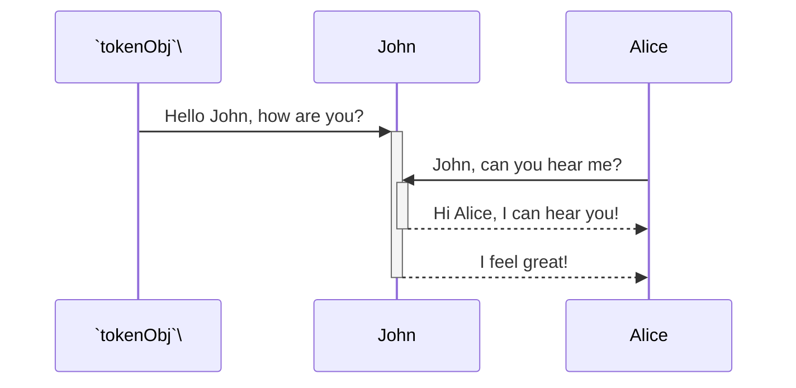

empty

<br/>

<!--MERMAID {width:100}-->
```mermaid

```
<!--MCONTENT {content: <br/>} --->

<br/>

error

<br/>

<!--MERMAID {width:100}-->
```mermaid

lk
```
<!--MCONTENT {content: <br/>
lk} --->

<br/>

<br/>

<br/>

<!--MERMAID {width:100}-->

<!--MCONTENT {content: sequenceDiagram<br/>
`tokenObj`<swm-token data-swm-token=":fileWithALotOfContent.js:1121:3:3:`                        const tokenObj = await response.json();`"/>\->>+John: Hello John, how are you?<br/>
Alice->>+John: John, can you hear me?<br/>
John\-\-\>>-Alice: Hi Alice, I can hear you!<br/>
John\-\-\>>-Alice: I feel great!<br/>} --->

<br/>

<br/>

<br/>

This file was generated by Swimm. [Click here to view it in the app](https://swimm-web-app.web.app/repos/Z2l0aHViJTNBJTNBdGVzdC1naXRodWItYXBwJTNBJTNBc3dpbW1pbw==/docs/76r0x).