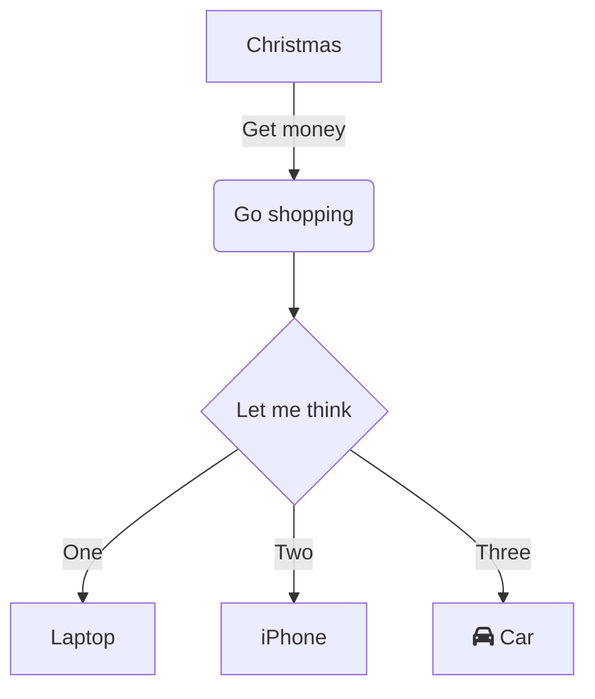

 

 

<!--MERMAID {width:100}-->

<!--MCONTENT {content: graph TD 
A\[Christmas\] \-\-\>|Get money| B(Go shopping) 
B \-\-\> C{Let me think} 
C \-\-\>|One| D\[Laptop\] 
C \-\-\>|Two| E\[iPhone\] 
C \-\-\>|Three| F\[fa:fa-car Car\] } --->

 

This file was generated by Swimm. [Click here to view it in the app](http://localhost:5000/repos/Z2l0aHViJTNBJTNBdGVzdC1naXRodWItYXBwJTNBJTNBc3dpbW1pbw==/docs/mse6h).