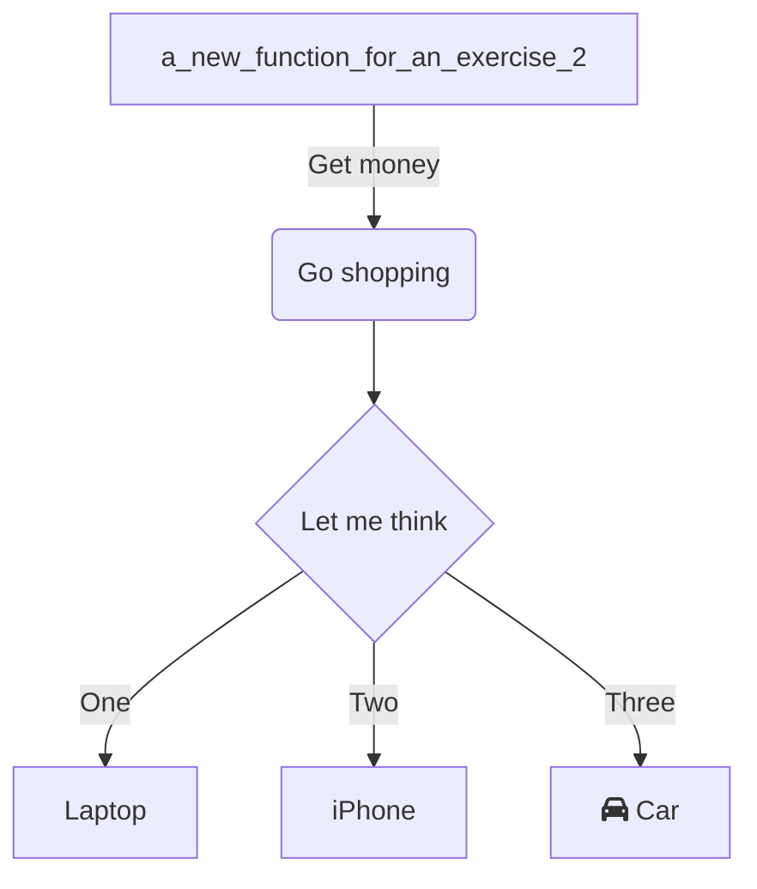
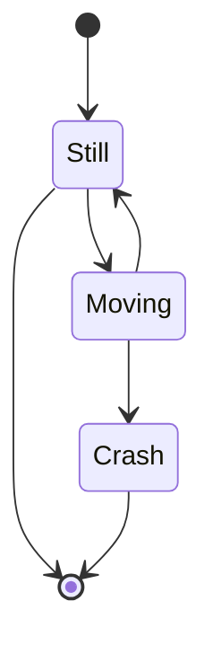

<br/>

<br/>

<!--MERMAID {width:100}-->

<!--MCONTENT {content: graph TD<br/>
A\[`a_new_function_for_an_exercise_2`[<sup id="Zm9Mwz">↓</sup>](#f-Zm9Mwz)\] \-\-\>|Get money| B(Go shopping)<br/>
B \-\-\> C{Let me think}<br/>
C \-\-\>|One| D\[Laptop\]<br/>
C \-\-\>|Two| E\[iPhone\]<br/>
C \-\-\>|Three| F\[fa:fa-car Car\]<br/>} --->

<br/>

<br/>

<br/>

<!--MERMAID {width:100}-->

<!--MCONTENT {content: stateDiagram-v2<br/>
\[\*\] \-\-\> Still<br/>
Still \-\-\> \[\*\]<br/>
Still \-\-\> Moving<br/>
Moving \-\-\> Still<br/>
Moving \-\-\> Crash<br/>
Crash \-\-\> \[\*\]} --->

<br/>

<!-- THIS IS AN AUTOGENERATED SECTION. DO NOT EDIT THIS SECTION DIRECTLY -->
### Swimm Note

<span id="f-Zm9Mwz">a_new_function_for_an_exercise_2</span>[^](#Zm9Mwz) - "amnon/pylint-report.py" L41
```python
def a_new_function_for_an_exercise_2():
```

<br/>

This file was generated by Swimm. [Click here to view it in the app](https://swimm-web-app.web.app/repos/Z2l0aHViJTNBJTNBdGVzdC1naXRodWItYXBwJTNBJTNBc3dpbW1pbw==/docs/mse6h).