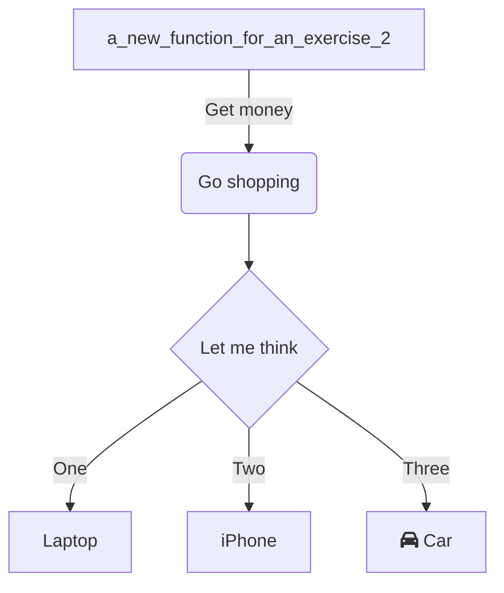
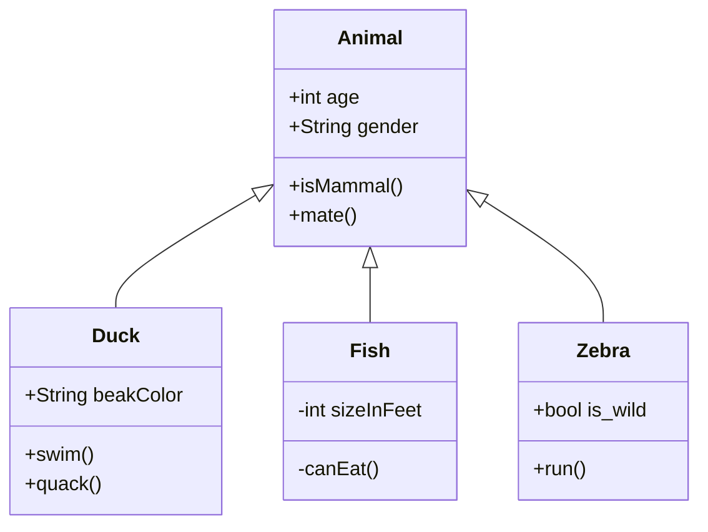

<br/>

<br/>

<!--MERMAID {width:100}-->

<!--MCONTENT {content: graph TD<br/>
A\[`a_new_function_for_an_exercise_2`[<sup id="Zm9Mwz">↓</sup>](#f-Zm9Mwz)\] \-\-\>|Get money| B(Go shopping)<br/>
B \-\-\> C{Let me think}<br/>
C \-\-\>|One| D\[Laptop\]<br/>
C \-\-\>|Two| E\[iPhone\]<br/>
C \-\-\>|Three| F\[fa:fa-car Car\]<br/>} --->

<br/>

<br/>

<br/>

<!--MERMAID {width:100}-->

<!--MCONTENT {content: classDiagram<br/>
Animal <|-- Duck<br/>
Animal <|-- Fish<br/>
Animal <|-- Zebra<br/>
Animal : +int age<br/>
Animal : +String gender<br/>
Animal: +isMammal()<br/>
Animal: +mate()<br/>
class Duck{<br/>
+String beakColor<br/>
+swim()<br/>
+quack()<br/>
}<br/>
class Fish{<br/>
\-int sizeInFeet<br/>
\-canEat()<br/>
}<br/>
class Zebra{<br/>
+bool is\_wild<br/>
+run()<br/>
}<br/>} --->

<br/>

<br/>

<br/>

<!-- THIS IS AN AUTOGENERATED SECTION. DO NOT EDIT THIS SECTION DIRECTLY -->
### Swimm Note

<span id="f-Zm9Mwz">a_new_function_for_an_exercise_2</span>[^](#Zm9Mwz) - "amnon/pylint-report.py" L41
```python
def a_new_function_for_an_exercise_2():
```

<br/>

This file was generated by Swimm. [Click here to view it in the app](http://localhost:5000/repos/Z2l0aHViJTNBJTNBdGVzdC1naXRodWItYXBwJTNBJTNBc3dpbW1pbw==/docs/mse6h).