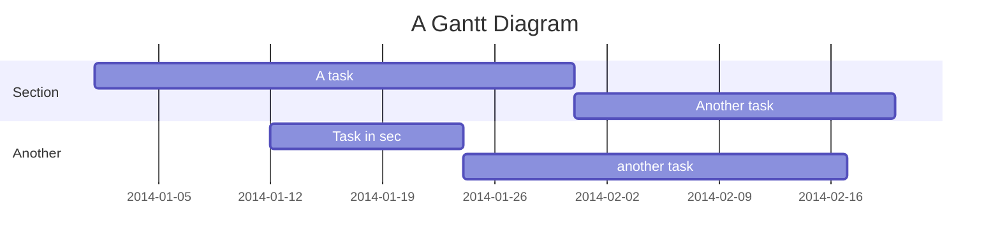
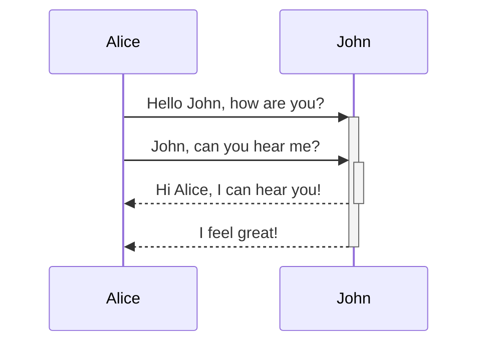

C

erDiagram 
CUSTOMER }|..|{ DELIVERY-ADDRESS : has 
CUSTOMER ||--o{ ORDER : places 
CUSTOMER ||--o{ INVOICE : "liable for" 
DELIVERY-ADDRESS ||--o{ ORDER : receives 
INVOICE ||--|{ ORDER : covers 
ORDER ||--|{ ORDER-ITEM : includes 
PRODUCT-CATEGORY ||--|{ PRODUCT : contains 
PRODUCT ||--o{ ORDER-ITEM : "ordered in" 

pie title Pets adopted by volunteers 
"Dogs" : 386 
"Cats" : 85 
"Rats" : 15 

 

<!--MERMAID {width:50}-->

<!--MCONTENT {content: gantt 
title A Gantt Diagram 
dateFormat YYYY-MM-DD 
section Section 
A task :a1, 2014-01-01, 30d 
Another task :after a1 , 20d 
section Another 
Task in sec :2014-01-12 , 12d 
another task : 24d } --->

 

e

erDiagram 
CUSTOMER }|..|{ DELIVERY-ADDRESS : has 
CUSTOMER ||--o{ ORDER : places 
CUSTOMER ||--o{ INVOICE : "liable for" 
DELIVERY-ADDRESS ||--o{ ORDER : receives 
INVOICE ||--|{ ORDER : covers 
ORDER ||--|{ ORDER-ITEM : includes 
PRODUCT-CATEGORY ||--|{ PRODUCT : contains 
PRODUCT ||--o{ ORDER-ITEM : "ordered in" 

erDiagram 
CUSTOMER }|..|{ DELIVERY-ADDRESS : has 
CUSTOMER ||--o{ ORDER : places 
CUSTOMER ||--o{ INVOICE : "liable for" 
DELIVERY-ADDRESS ||--o{ ORDER : receives 
INVOICE ||--|{ ORDER : covers 
ORDER ||--|{ ORDER-ITEM : includes 
PRODUCT-CATEGORY ||--|{ PRODUCT : contains 
PRODUCT ||--o{ ORDER-ITEM : "ordered in" 

 

<!--MERMAID {width:25}-->

<!--MCONTENT {content: sequenceDiagram 
Alice->>+John: Hello John, how are you? 
Alice->>+John: John, can you hear me? 
John\-\-\>>-Alice: Hi Alice, I can hear you! 
John\-\-\>>-Alice: I feel great! 

 } --->

 

jjj

jjjj

 

This file was generated by Swimm. [Click here to view it in the app](https://swimm-web-app.web.app/repos/Z2l0aHViJTNBJTNBdGVzdC1naXRodWItYXBwJTNBJTNBc3dpbW1pbw==/docs/838n4).