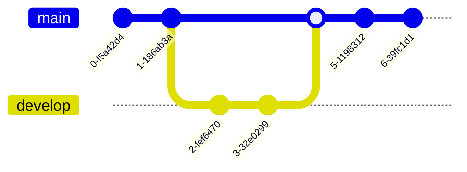

Checking if a graph is valid.

 

<!--MERMAID {width:100}-->

<!--MCONTENT {content: gitGraph 
commit 
commit 
branch develop 
checkout develop 
commit 
commit 
checkout main 
merge develop 
commit 
commit } --->

 

This file was generated by Swimm. [Click here to view it in the app](https://swimm-web-app.web.app/repos/Z2l0aHViJTNBJTNBdGVzdC1naXRodWItYXBwJTNBJTNBc3dpbW1pbw==/docs/838n4).