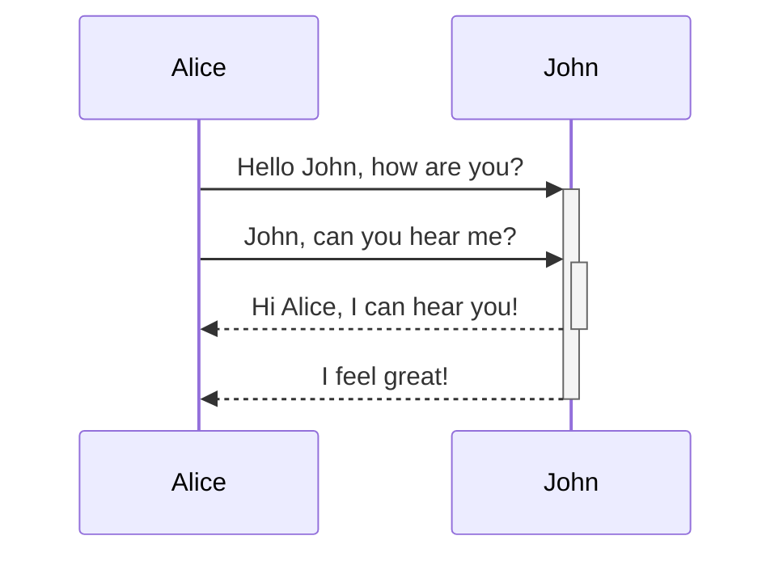
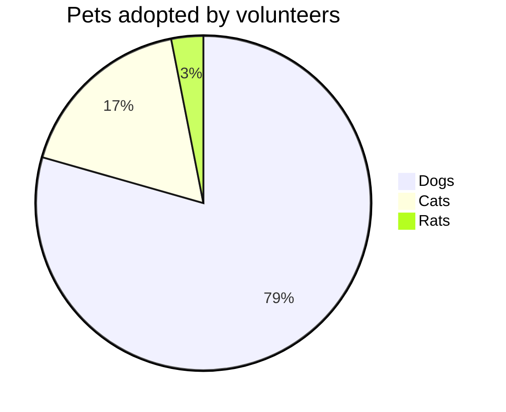
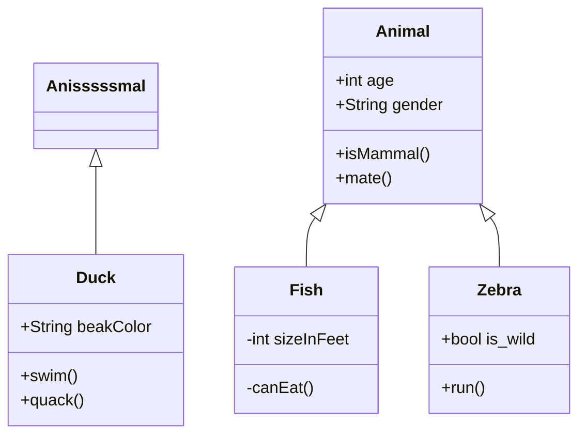

 

 

<!--MERMAID {width:100}-->

<!--MCONTENT {content: sequenceDiagram 
Alice->>+John: Hello John, how are you? 
Alice->>+John: John, can you hear me? 
John\-\-\>>-Alice: Hi Alice, I can hear you! 
John\-\-\>>-Alice: I feel great! 

 

 } --->

 

 

 

 

<!--MERMAID {width:100}-->

<!--MCONTENT {content: pie title Pets adopted by volunteers 
"Dogs" : 386 
"Cats" : 85 
"Rats" : 15 } --->

 

sss

ssssswsw

 

<!--MERMAID {width:100}-->

<!--MCONTENT {content: classDiagram 
Anisssssmal <|-- Duck 
Animal <|-- Fish 
Animal <|-- Zebra 
Animal : +int age 
Animal : +String gender 
Animal: +isMammal() 
Animal: +mate() 
class Duck{ 
+String beakColor 
+swim() 
+quack() 
} 
class Fish{ 
\-int sizeInFeet 
\-canEat() 
} 
class Zebra{ 
+bool is\_wild 
+run() 
} } --->

 

This file was generated by Swimm. [Click here to view it in the app](https://swimm-web-app.web.app/repos/Z2l0aHViJTNBJTNBdGVzdC1naXRodWItYXBwJTNBJTNBc3dpbW1pbw==/docs/838n4).