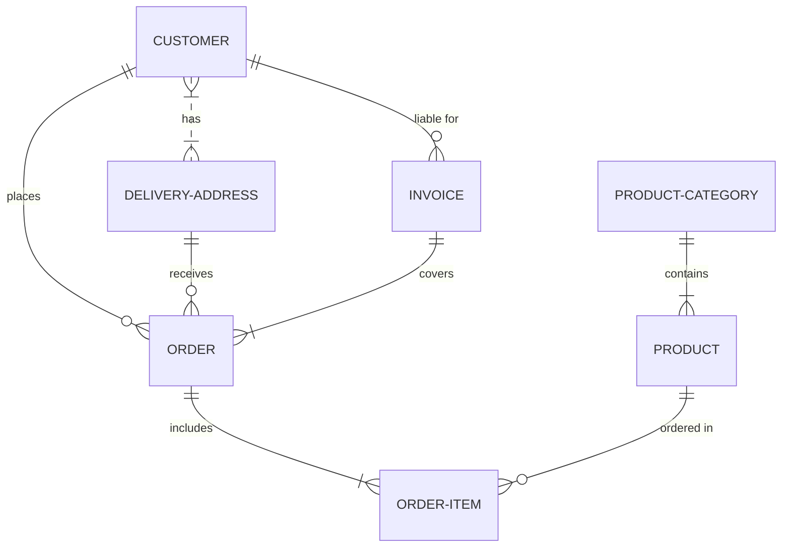

Checking if a graph is valid.

 

<!--MERMAID {width:100}-->

<!--MCONTENT {content: erDiagram 
CUSTOMER }|..|{ DELIVERY-ADDRESS : has 
CUSTOMER ||--o{ ORDER : places 
CUSTOMER ||--o{ INVOICE : "liable for" 
DELIVERY-ADDRESS ||--o{ ORDER : receives 
INVOICE ||--|{ ORDER : covers 
ORDER ||--|{ ORDER-ITEM : includes 
PRODUCT-CATEGORY ||--|{ PRODUCT : contains 
PRODUCT ||--o{ ORDER-ITEM : "ordered in" } --->

 

 

 

This file was generated by Swimm. [Click here to view it in the app](https://swimm-web-app.web.app/repos/Z2l0aHViJTNBJTNBdGVzdC1naXRodWItYXBwJTNBJTNBc3dpbW1pbw==/docs/838n4).