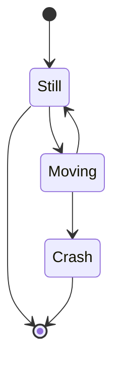

 

 

<!--MERMAID {width:100}-->

<!--MCONTENT {content: stateDiagram-v2 
\[\*\] \-\-\> Still 
Still \-\-\> \[\*\] 
Still \-\-\> Moving 
Moving \-\-\> Still 
Moving \-\-\> Crash 
Crash \-\-\> \[\*\] } --->

 

 

 

<!--MERMAID {width:100}-->

<!--MCONTENT {content: classDiagram 
Animal <|-- Duck 
Animal <|-- Fish 
Animal <|-- Zebra 
Animal : +int age 
Animal : +String gender 
Animal: +isMammal() 
Animal: +mate() 
class Duck{ 
+String beakColor 
+swim() 
+quack() 
} 
class Fish{ 
\-int sizeInFeet 
\-canEat() 
} 
class Zebra{ 
+bool is\_wild 
+run() 
} } --->

 

 

 

<!--MERMAID {width:100}-->

<!--MCONTENT {content: graph TD 
A\[Christmas\] \-\-\>|Get money| B(Go shopping) 
B \-\-\> C{Let me think} 
C \-\-\>|One| D\[Laptop\] 
C \-\-\>|Two| E\[iPhone\] 
C \-\-\>|Three| F\[fa:fa-car Car\] } --->

 

This file was generated by Swimm. [Click here to view it in the app](https://swimm-web-app.web.app/repos/Z2l0aHViJTNBJTNBdGVzdC1naXRodWItYXBwJTNBJTNBc3dpbW1pbw==/docs/838n4).