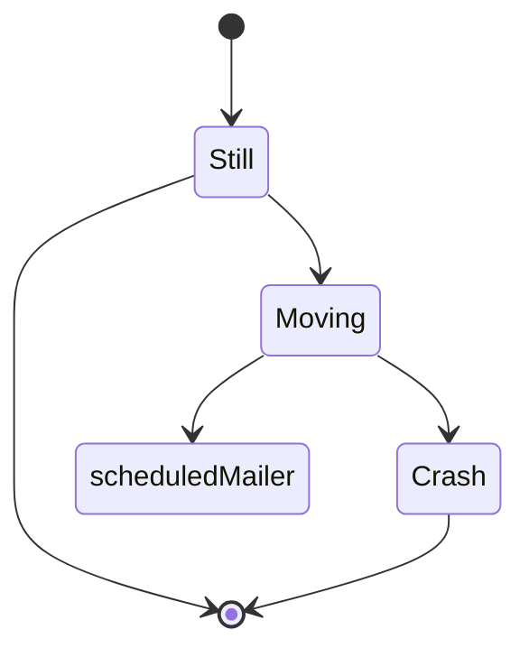

<br/>

<br/>

<!--MERMAID {width:100}-->

<!--MCONTENT {content: stateDiagram-v2<br/>
\[\*\] \-\-\> Still<br/>
Still \-\-\> \[\*\]<br/>
Still \-\-\> Moving<br/>
Moving \-\-\> `scheduledMailer`[<sup id="1AyL8m">↓</sup>](#f-1AyL8m)<br/>
Moving \-\-\> Crash<br/>
Crash \-\-\> \[\*\]} --->

<br/>

<br/>

<br/>


<!-- NOTE-swimm-snippet: the lines below link your snippet to Swimm -->
### 📄 fileWithALotOfContent.js
```javascript
⬜ 72         return emails;
⬜ 73     }
⬜ 74     
🟩 75     export const sayDocThanks = sayThanksFunctions.sayDocThanks;
🟩 76     export const addUserProperties = trackingFunctions.addUserProperties;
🟩 77     export const addAccountProperties = trackingFunctions.addAccountProperties;
🟩 78     export const groupEvent = trackingFunctions.groupEvent;
🟩 79     export const trackEvent = trackingFunctions.trackEvent;
🟩 80     export const updateLoginInSalesforce = salesforceFunctions.updateLoginInSalesforce;
🟩 81     export const updateSignupInSalesforce = salesforceFunctions.updateSignupInSalesforce;
🟩 82     export const updateWorkspaceInSalesforce = salesforceFunctions.updateWorkspaceInSalesforce;
🟩 83     export const updateWorkspaceUserInSalesforce = salesforceFunctions.updateWorkspaceUserInSalesforce;
🟩 84     export const updateRepoInSalesforce = salesforceFunctions.updateRepoInSalesforce;
🟩 85     export const sendCRMForm = salesforceFunctions.sendCRMForm;
🟩 86     export const compassResolveRepo = compassFunctions.compassResolveRepo;
⬜ 87     export const compassSetTrigger = compassFunctions.compassSetTrigger;
⬜ 88     export const setIsRepoPrivate = repoFunctions.setIsRepoPrivate;
⬜ 89     export const slackAuth = slackFunctions.slackAuth;
```

<br/>

<br/>

<br/>

<!-- THIS IS AN AUTOGENERATED SECTION. DO NOT EDIT THIS SECTION DIRECTLY -->
### Swimm Note

<span id="f-1AyL8m">scheduledMailer</span>[^](#1AyL8m) - "fileWithALotOfContent.js" L1702
```javascript
export const scheduledMailer = functions.pubsub.schedule('every 24 hours').onRun(
```

<br/>

This file was generated by Swimm. [Click here to view it in the app](http://localhost:5000/repos/Z2l0aHViJTNBJTNBdGVzdC1naXRodWItYXBwJTNBJTNBc3dpbW1pbw==/docs/c9juz).