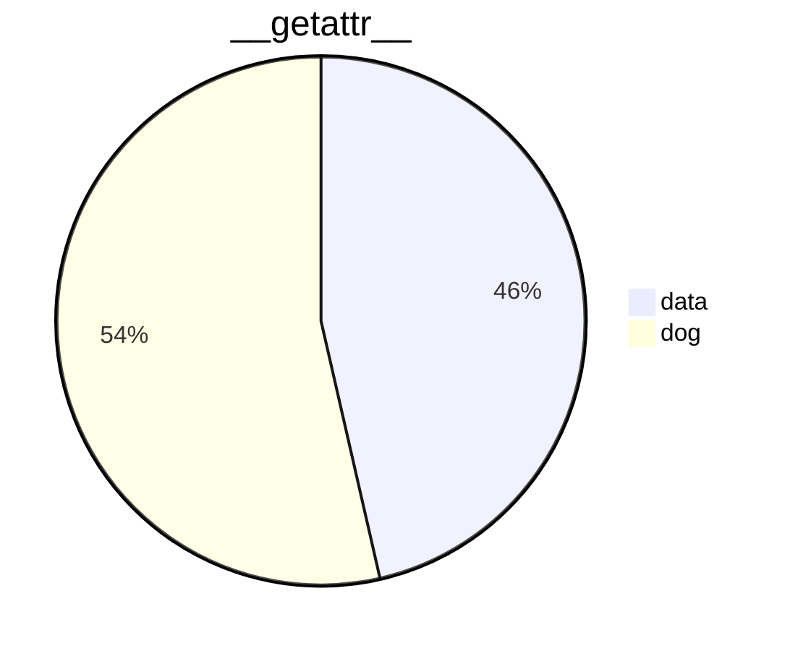

<br/>

<br/>

<!--MERMAID {width:100}-->

<!--MCONTENT {content: pie title `__getattr__`[<sup id="Z2bb1rH">↓</sup>](#f-Z2bb1rH)
"`data`[<sup id="Z1Y6tPg">↓</sup>](#f-Z1Y6tPg)": 123
"dog": 142} --->

<br/>

<!-- THIS IS AN AUTOGENERATED SECTION. DO NOT EDIT THIS SECTION DIRECTLY -->
### Swimm Note

<span id="f-Z2bb1rH">__getattr__</span>[^](#Z2bb1rH) - "amnon/process-har.py" L11
```python
    def __getattr__(self, attr):
```

<span id="f-Z1Y6tPg">data</span>[^](#Z1Y6tPg) - "fileWithALotOfContent.js" L1816
```javascript
    data() {
```

<br/>

This file was generated by Swimm. [Click here to view it in the app](https://swimm-web-app.web.app/repos/Z2l0aHViJTNBJTNBdGVzdC1naXRodWItYXBwJTNBJTNBc3dpbW1pbw==/docs/16rvz).