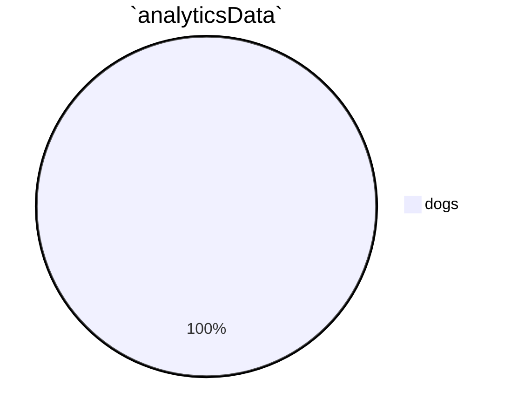

 

 

<!--MERMAID {width:100}-->

<!--MCONTENT {content: "pie title `analyticsData`<swm-token data-swm-token=\":fileWithALotOfContent.js:3355:3:3:`                let analyticsData = {`\"/> \n\"dogs\": 12"} --->

 

ddd

 

This file was generated by Swimm. [Click here to view it in the app](https://swimm-web-app.web.app/repos/Z2l0aHViJTNBJTNBdGVzdC1naXRodWItYXBwJTNBJTNBc3dpbW1pbw==/docs/1syfx).
