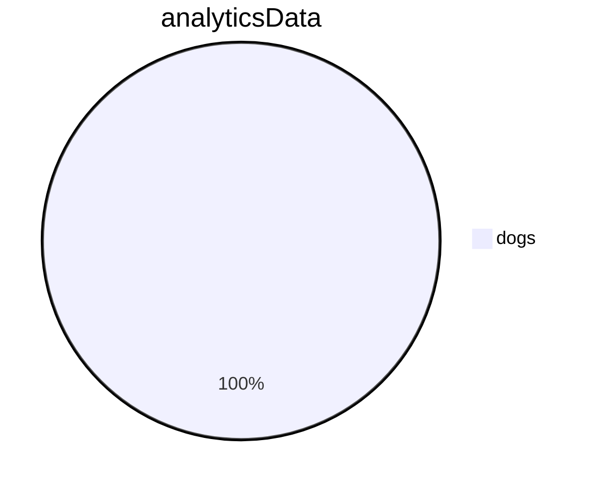

<br/>

<br/>

<!--MERMAID {width:100}-->

<!--MCONTENT {content: pie title `analyticsData`[<sup id="zhkvo">↓</sup>](#f-zhkvo)

"dogs": 12} --->

<br/>

<!-- THIS IS AN AUTOGENERATED SECTION. DO NOT EDIT THIS SECTION DIRECTLY -->
### Swimm Note

<span id="f-zhkvo">analyticsData</span>[^](#zhkvo) - "fileWithALotOfContent.js" L3355
```javascript
                let analyticsData = {
```

<br/>

This file was generated by Swimm. [Click here to view it in the app](https://swimm-web-app.web.app/repos/Z2l0aHViJTNBJTNBdGVzdC1naXRodWItYXBwJTNBJTNBc3dpbW1pbw==/docs/1syfx).