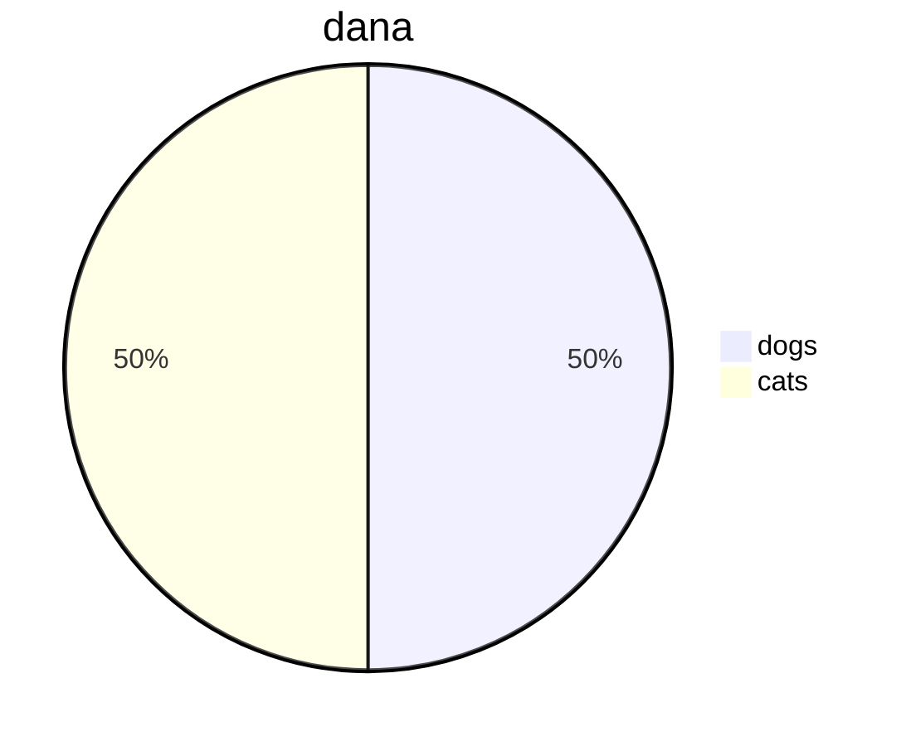

 

 

<!--MERMAID {width:100}-->

<!--MCONTENT {content: pie title dana
"dogs": 12
"cats": 12} --->

 

poieie titl

 

This file was generated by Swimm. [Click here to view it in the app](https://swimm-web-app.web.app/repos/Z2l0aHViJTNBJTNBdGVzdC1naXRodWItYXBwJTNBJTNBc3dpbW1pbw==/docs/pwqtu).